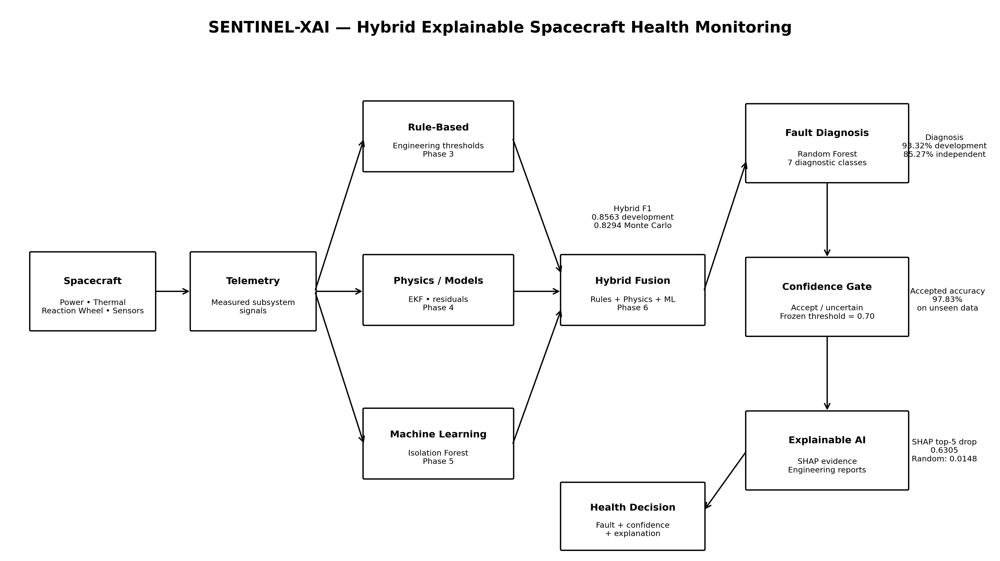
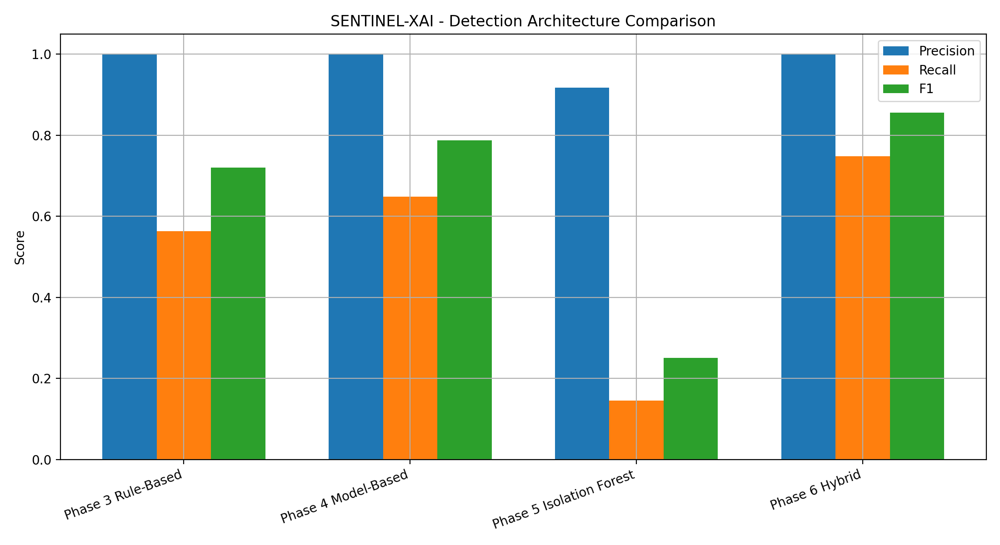
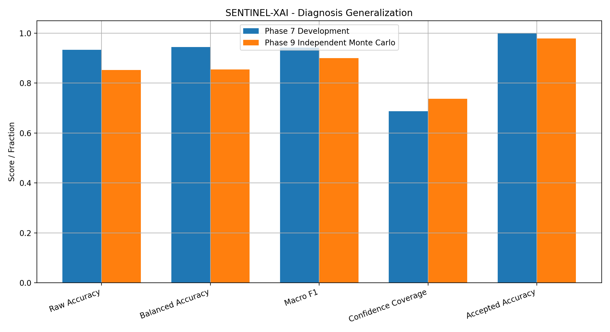
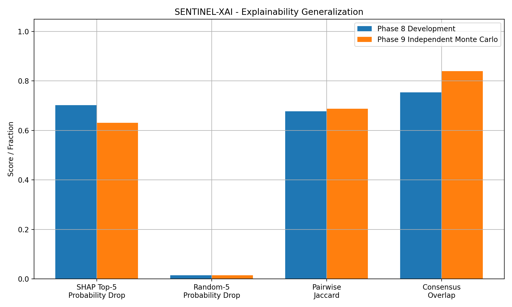
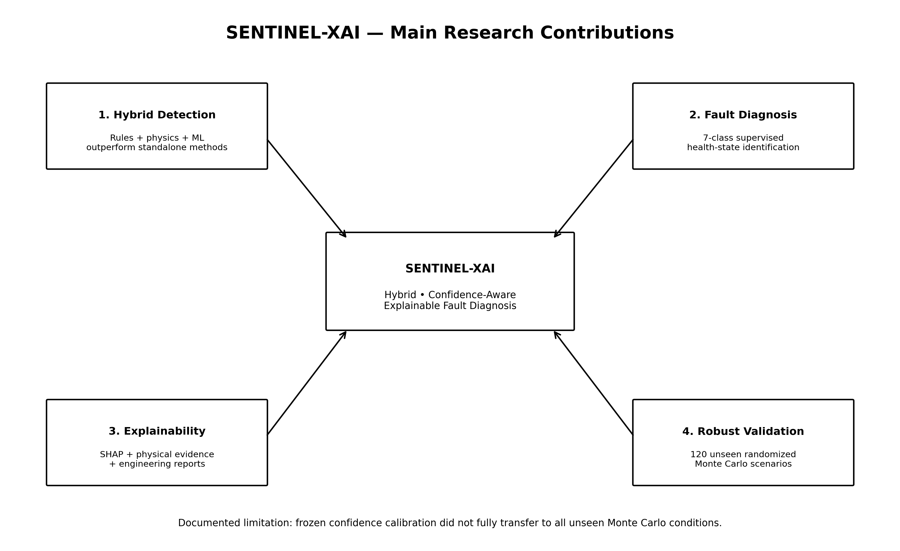
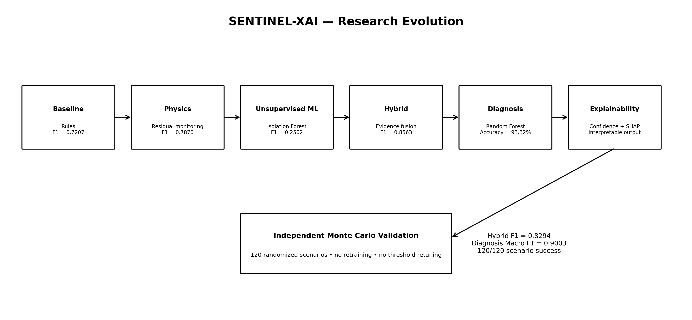

# SENTINEL-XAI

## Hybrid Explainable AI for Spacecraft Health Monitoring and Fault Diagnosis

SENTINEL-XAI is a research prototype for **hybrid, confidence-aware, and explainable spacecraft fault detection and diagnosis**.

The project combines engineering knowledge, physics-based monitoring, machine learning, supervised diagnosis, confidence-aware decisions, and explainable AI to monitor spacecraft subsystem health.

---

## Overview

Traditional spacecraft health-monitoring methods have different strengths and weaknesses.

- Rule-based systems are interpretable but may miss gradual faults.
- Physics/model-based monitoring can detect deviations from expected behavior but depends on model fidelity.
- Machine-learning methods can discover complex patterns but may be difficult to interpret and may generalize poorly outside their training conditions.

SENTINEL-XAI investigates whether these approaches can be combined so that their strengths compensate for one another.

The final architecture integrates:

```text
Engineering Rules
        +
Physics / Model Residuals
        +
Machine-Learning Evidence
        ↓
    Hybrid Fusion
        ↓
Random Forest Diagnosis
        ↓
  Confidence Gate
        ↓
  SHAP Explanation
        ↓
   Health Decision
```

---

## System Architecture

<p align="center">
  
</p>

The complete pipeline processes spacecraft telemetry using three complementary monitoring paths:

**Rule-Based Detection → Physics/Model-Based Monitoring → Unsupervised ML → Hybrid Fusion → Supervised Fault Diagnosis → Confidence Gate → SHAP Explainability**

---

## Simulated Spacecraft

The simulation environment models several spacecraft subsystems:

- Electrical power generation
- Spacecraft electrical load
- Battery state of charge
- Battery voltage and current
- Battery thermal dynamics
- Electronics thermal dynamics
- Reaction-wheel dynamics
- Reaction-wheel current and temperature
- Noisy telemetry sensors

Both nominal and faulted spacecraft behavior are simulated.

---

## Fault Classes

Six spacecraft fault modes are implemented:

1. Solar-array degradation
2. Battery degradation
3. Thermal anomaly
4. Reaction-wheel degradation
5. Battery-voltage sensor drift
6. Telemetry dropout

Together with the nominal state, the diagnosis system contains **7 diagnostic classes**.

---

# Detection Architecture

## Rule-Based Detection

Engineering thresholds provide the first baseline.

| Metric | Result |
|---|---:|
| Precision | 1.0000 |
| Recall | 0.5634 |
| F1 | 0.7207 |
| Mean Detection Delay | 33.7 min |

The rules were highly precise but missed several weak or gradual faults.

---

## Physics / Model-Based Monitoring

The physics-informed monitoring layer uses:

- Battery EKF state estimation
- Battery voltage residuals
- Thermal residuals
- Reaction-wheel current residuals
- Reaction-wheel temperature residuals

Results:

| Metric | Result |
|---|---:|
| Precision | 1.0000 |
| Recall | 0.6488 |
| F1 | 0.7870 |
| Mean Detection Delay | 16.7 min |

---

## Unsupervised Machine Learning

Subsystem-specific **Isolation Forest** models were trained using nominal telemetry only.

Results:

| Metric | Result |
|---|---:|
| Precision | 0.9174 |
| Recall | 0.1448 |
| F1 | 0.2502 |

The experiment showed that unsupervised anomaly detection alone was insufficient for several gradual spacecraft faults.

---

## Hybrid Detection

The final detector combines:

```text
Rules + Physics + Machine Learning
```

Results:

| Detection Method | Precision | Recall | F1 |
|---|---:|---:|---:|
| Rule-Based | 1.0000 | 0.5634 | 0.7207 |
| Model-Based | 1.0000 | 0.6488 | 0.7870 |
| Isolation Forest | 0.9174 | 0.1448 | 0.2502 |
| **Hybrid Fusion** | **1.0000** | **0.7487** | **0.8563** |

<p align="center">
  
</p>

The hybrid architecture achieved the strongest development F1-score.

---

# Fault Diagnosis

Detection identifies whether abnormal behavior exists.

The next stage identifies **what fault is occurring**.

A supervised **Random Forest** classifier was trained using a 57-feature diagnostic representation containing:

- Measured spacecraft telemetry
- Rule-based detector outputs
- Physics/model residuals
- Model-based predictions
- ML anomaly evidence

Development results:

| Metric | Result |
|---|---:|
| Accuracy | 0.9332 |
| Balanced Accuracy | 0.9447 |
| Macro F1 | 0.9419 |

---

# Confidence-Aware Diagnosis

A confidence gate is used to avoid automatically accepting uncertain diagnoses.

The frozen threshold is:

```text
confidence >= 0.70
```

Predictions are therefore classified as:

```text
Accepted
```

or:

```text
Uncertain
```

Development results:

| Metric | Result |
|---|---:|
| Coverage | 0.6870 |
| Accepted Accuracy | 1.0000 |
| Error Capture | 1.0000 |

The threshold was frozen before independent Monte Carlo testing.

---

# Explainable AI

SENTINEL-XAI uses **SHAP** to explain the Random Forest diagnosis model.

The explanations identify which telemetry, residual, rule, physics, and ML features contributed most strongly to each diagnosis.

Development explanation faithfulness:

| Metric | Result |
|---|---:|
| SHAP Top-5 Probability Drop | 0.7026 |
| Random-5 Probability Drop | 0.0145 |
| SHAP Top-5 Beats Random | 99.72% |
| Prediction Flip After SHAP Top-5 Removal | 80.83% |

This indicates that the SHAP-ranked features were strongly associated with the model's predictions.

SHAP is used to explain **model behavior**, not to claim physical causality.

---

# Independent Monte Carlo Validation

The final frozen system was evaluated using:

```text
120 independently generated randomized fault scenarios
```

Each of the six fault types was tested in 20 scenarios.

The randomized parameters included:

- Fault start time
- Fault severity
- Abrupt or gradual fault profile
- Ramp duration
- Sensor noise
- Random seed

Importantly:

```text
Retraining on Monte Carlo data: NO
Confidence-threshold retuning: NO
```

---

## Independent Detection Performance

| Method | Precision | Recall | F1 |
|---|---:|---:|---:|
| Rule-Based | 0.9958 | 0.5074 | 0.6722 |
| Physics-Based | 1.0000 | 0.6039 | 0.7531 |
| **Hybrid** | **0.9970** | **0.7100** | **0.8294** |

The hybrid detector retained strong performance under randomized unseen conditions.

---

# Independent Diagnosis Performance

| Metric | Development | Independent Monte Carlo |
|---|---:|---:|
| Raw Accuracy | 0.9332 | 0.8527 |
| Balanced Accuracy | 0.9447 | 0.8541 |
| Macro F1 | 0.9419 | 0.9003 |
| Confidence Coverage | 0.6870 | 0.7371 |
| Accepted Accuracy | 1.0000 | 0.9783 |

<p align="center">
  
</p>

Every one of the:

```text
120 / 120 scenarios
```

eventually produced at least one correct accepted diagnosis.

Mean correct diagnosis delay:

```text
19.45 minutes
```

Median correct diagnosis delay:

```text
12.55 minutes
```

---

# Independent Explainability Results

Independent Monte Carlo SHAP evaluation produced:

| Metric | Result |
|---|---:|
| SHAP Top-5 Probability Drop | 0.6305 |
| Random-5 Probability Drop | 0.0148 |
| SHAP Beats Random | 1.0000 |
| Mean Pairwise Jaccard | 0.6876 |
| Monte Carlo Consensus Overlap | 0.8400 |
| Development-to-Monte-Carlo Overlap | 0.7333 |

<p align="center">
  
</p>

SHAP-selected features outperformed random feature ablation in:

```text
120 / 120 Monte Carlo scenarios
```

---

# Research Contributions

<p align="center">
  
</p>

The main contributions of SENTINEL-XAI are:

1. **Hybrid spacecraft fault detection** combining rules, physics/model residuals, and ML evidence.
2. **Explicit fault diagnosis** using supervised learning instead of anomaly detection alone.
3. **Confidence-aware decisions** that allow uncertain predictions to be rejected.
4. **Explainable diagnosis** using SHAP and engineering evidence.
5. **Independent robustness validation** using 120 randomized scenarios without retraining or test-set tuning.

---

# Research Evolution

<p align="center">
  
</p>

The project was developed incrementally:

```text
Spacecraft Simulation
        ↓
Fault Injection
        ↓
Rule-Based Detection
        ↓
Physics-Based Monitoring
        ↓
Unsupervised ML
        ↓
Hybrid Fusion
        ↓
Supervised Diagnosis
        ↓
Confidence-Aware Decisions
        ↓
Explainable AI
        ↓
Independent Monte Carlo Validation
```

---

# Main Limitations

Independent testing revealed several limitations.

### Battery Degradation

Battery degradation remained the most difficult physical fault.

Independent results included:

```text
Confidence coverage: 0.3373
Mean diagnosis delay: 51.99 minutes
```

### Confidence Calibration

The frozen `0.70` confidence threshold achieved:

```text
Coverage:           0.7371
Accepted accuracy:  0.9783
Error capture:      0.8913
```

The original development targets were:

```text
Accepted accuracy >= 0.99
Error capture      >= 0.95
Coverage           >= 0.60
```

The first two targets were therefore not reproduced on the independent Monte Carlo distribution.

The threshold was deliberately **not retuned** using the independent test set.

---

# Repository Structure

```text
SENTINEL-XAI/
│
├── data/
│   ├── nominal/
│   ├── faults/
│   └── monte_carlo/
│
├── src/
│   ├── simulation/
│   ├── faults/
│   ├── estimation/
│   ├── detection/
│   └── diagnosis/
│
├── experiments/
│
├── results/
│   ├── figures/
│   ├── tables/
│   ├── models/
│   └── reports/
│
├── docs/
│
├── tests/
│
├── README.md
├── REPRODUCIBILITY.md
└── requirements.txt
```

---

# Installation

Clone the repository:

```bash
git clone https://github.com/YOUR_USERNAME/SENTINEL-XAI.git
cd SENTINEL-XAI
```

Install dependencies:

```bash
python -m pip install -r requirements.txt
```

Main dependencies:

```text
Python 3
NumPy
pandas
Matplotlib
scikit-learn
joblib
SHAP
```

---

# Reproducing the Main Results

Final hybrid validation:

```bash
python experiments/experiment_035_phase6_final_validation.py
```

Final supervised diagnosis validation:

```bash
python experiments/experiment_040_phase7_final_validation.py
```

Final XAI validation:

```bash
python experiments/experiment_045_phase8_final_validation.py
```

Final Monte Carlo validation:

```bash
python experiments/experiment_052_phase9_final_validation.py
```

Final research results:

```bash
python experiments/experiment_053_final_research_summary.py
```

Final architecture figures:

```bash
python experiments/experiment_054_final_architecture_figures.py
```

See `REPRODUCIBILITY.md` for the complete experimental sequence.

---

# Project Scale

Final repository audit:

```text
10 / 10 project phases complete
9 / 9 final validation checks passed

23 source Python files
56 experiment scripts
131 result tables
109 figures
4 saved models
12 research reports
120 Monte Carlo datasets
```

---

# Project Status

| Component | Status |
|---|---|
| Spacecraft Simulation | ✅ Complete |
| Fault Injection | ✅ Complete |
| Rule-Based Detection | ✅ Complete |
| Physics-Based Monitoring | ✅ Complete |
| Unsupervised ML | ✅ Complete |
| Hybrid Fusion | ✅ Complete |
| Fault Diagnosis | ✅ Complete |
| Confidence-Aware Diagnosis | ✅ Complete |
| Explainable AI | ✅ Complete |
| Monte Carlo Robustness | ✅ Complete |
| Research Packaging | ✅ Complete |

---

# Technical Report

A concise technical report describing the complete project is available at:

```text
docs/SENTINEL-XAI_Report.pdf
```

---

# Future Work

Future extensions could include:

- Simultaneous multi-fault scenarios
- Higher-fidelity spacecraft models
- Real spacecraft telemetry
- Hardware-in-the-loop validation
- Independent probability calibration
- Additional spacecraft subsystems
- Onboard computational benchmarking
- Domain adaptation between spacecraft platforms
- More advanced temporal diagnosis models

---

# Scientific Scope

SENTINEL-XAI is a **simulation-based research prototype**.

The reported performance applies to the spacecraft models, fault mechanisms, sensors, and randomized scenarios implemented in this repository.

The results should **not** be interpreted as:

- Flight qualification
- Spacecraft certification
- Operational deployment readiness
- Universal spacecraft fault-diagnosis performance

---

## Final Result

SENTINEL-XAI demonstrates that combining:

```text
Engineering Rules
      +
Physics-Based Monitoring
      +
Machine Learning
      +
Supervised Diagnosis
      +
Confidence Awareness
      +
Explainable AI
```

can provide stronger and more interpretable spacecraft fault monitoring than relying on a single detection method alone.

The final frozen architecture retained useful detection, diagnosis, and explanation performance across **120 independently randomized spacecraft fault scenarios** without retraining or test-set threshold tuning.
